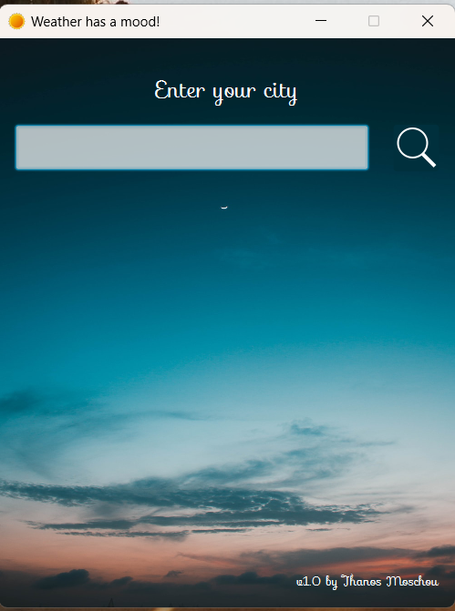

## Moods Weather
Did you know that weather has its own mood? <br>
Enter your city to find it!! <br>

### Screenshots



### How it works
Type the name of your city, press the search button and let the app show you the weather forecast! <br>
The app uses 2 apis to get the job done. <br>
The first api is the Geocoding API of https://www.open-meteo.com <br>
App sends a request to this api by providing a city's name and it gets back the longitude and the latitude of the city <br>
(First it receives a JSON response and it manipulates the JSON to get the longitude and the latitude). <br>
The second api is the Weather Forecast API of Open-Meteo. <br>
App makes a request providing the longitude and the latitude of a city and it gets back a JSON response. Finally by handling this JSON response<br>
it gets the weather info.

### Requirements
You need Java installed on your PC. <br>
Also you need JavaFX (Download the JavaFX SDK from the original site). <br>

#### On Eclipse
Download e(fx)clipse plugin for Eclipse. <br>
Import the project. <br>
File -> Import -> General -> Projects from Folder or Archive -> Select the Directory button <br>
if you have a folder or select the Archive button if you have a zip file -> Finish <br><br>

First you need to create a user library: <br>
On the menu above select Window -> Preferences -> Java -> Build Path -> User Libraries -> New -> Enter a name -> Select the library you just created -> Add External JARs -> select the jars you want (we want the jar files that are included in the lib folder of javafx sdk) -> Apply and Close <br><br>

Add the JavaFX SDK as a library. <br>
Right click on project -> Build Path -> Add Libraries -> User Library -> Select the one you created for javafx -> Finish <br>

Now you need to type something more: Right click on the project -> Run As -> Run Configurations -> On the menu in the central part of the page select Arguments -> On the vm arguments section type: 
```--module-path "path\to\javafx\lib" --add-modules javafx.controls,javafx.fxml``` <br>

Make sure you have changed ```path\to\javafx\lib``` to the original path of the javafx sdk lib folder. <br>
Finally press Apply and then Run. <br>

If you have an error while initializing boot layer:
Right click on project -> Build Path -> Configure Build Path -> Java Build Path -> Check that javafx sdk that comes with e(fx)clipse is in classpath and not in module path. If it is in the module path, move it to the class path by drag and drop. <br><br>

### Alternative ways to run the app
Open the runnableJar folder in a command line interface (Right click in the folder -> Open in Terminal. Then type the following command: <br>

```
java --module-path "path\to\javafx\lib" --add-modules javafx.controls,javafx.fxml -jar moods.jar
```

Make sure you have changed ```path\to\javafx\lib``` to the original path of the javafx sdk lib folder. <br>

